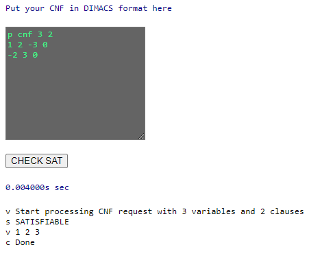

# What is KoSAT?
 

KoSAT is **pure Kotlin** CDCL SAT solver based on MiniSat core.
It is solving boolean satisfiability problems given in DIMACS format.
Solver supports incremental solving.

## How to use KoSAT?
There are many ways how to use our solver:
<details>
  <summary>On site</summary>
<br/>
In the picture below you can see site dialog window. 
All you need is to enter the problem in DIMACS format and click on the
***CHECK SAT*** button.

[](http://www.utbot.org/kosat/)

The site is available at the link below:

> http://www.utbot.org/kosat/
____________
</details>
<details>
  <summary>By Javascript</summary>

1. Download kosat.js file from releases.
2. Import this file in your. For example:  
`const kosat = require("./kosat.js");`
3. Use Kosat interface (described in [incremental](docs/incremental.md) documentation).
____________
</details>
<details>
  <summary>By Java/Kotlin</summary>
<br/>
Use KoSAT directly from Kotlin. You can add it as a JitPack
dependency. 

To get a Git project into your build:

- **Step 1**. Add the JitPack repository to your build file

Add it in your root build.gradle at the end of repositories:


```
allprojects {
    repositories {
        ...
        maven(url = "https://jitpack.io")
    }
}
```

- **Step 2**. Add the dependency

```
dependencies {
    implementation("com.github.UnitTestBot.kosat:kosat:docs-SNAPSHOT")
}
```

Now you can use KoSAT project.
### Here is simple code example:
```
import org.kosat.Kosat

fun main() {
// Create the SAT solver:
val solver = Kosat(mutableListOf(), 0)

    // Allocate two variables:
    solver.addVariable()
    solver.addVariable()

    // Encode TIE-SHIRT problem:
    solver.addClause(-1, 2)
    solver.addClause(1, 2)
    solver.addClause(-1, -2)
    // solver.addClause(1, -2) // UNSAT with this clause

    // Solve the SAT problem:
    val result = solver.solve()
    println("result = $result")

    // Get the model:
    val model = solver.getModel()
    println("model = $model")
}
```
Find more about KoSAT interface [here](docs/interface.md).
____________
</details>

## Heuristics and Features

<details>
  <summary>Main features implemented in solver</summary>

1. [ReNumeration](docs/numeration.md)
2. [Trail](docs/trail.md)
3. [Conflict analysis](docs/analyze.md)
4. [Backjump](docs/backjump.md)
5. [Propagation](docs/propagation.md)
6. [2-watched literals](docs/watched%20literals.md)
7. [VSIDS](docs/branching.md)
8. [Luby restarts](docs/restarts.md)
9. [Phase saving](docs/phase%20saving.md)
10. [ReduceDB based on LBD](docs/reduceDB.md)

</details>

## Documentation

Our solver has a detailed documentation about everything you might
need to know. **It may be useful even if you are new to SAT problem.**


> Check this out [here](docs/docs.md).

## Contribution & Support ⭐
KoSAT is an open source project. If you have found any bugs
or want to suggest some effective heuristics for solver, we are
open for your help! 

If you have any troubles while using our solver, you can contact
us in telegram:
@AlxVlsv, @dvrr9, @polinarria
